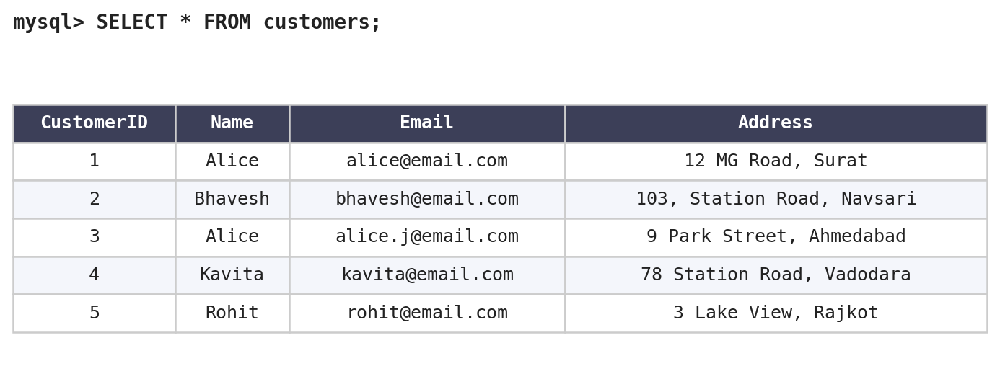
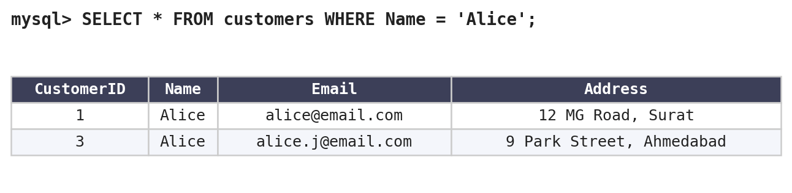
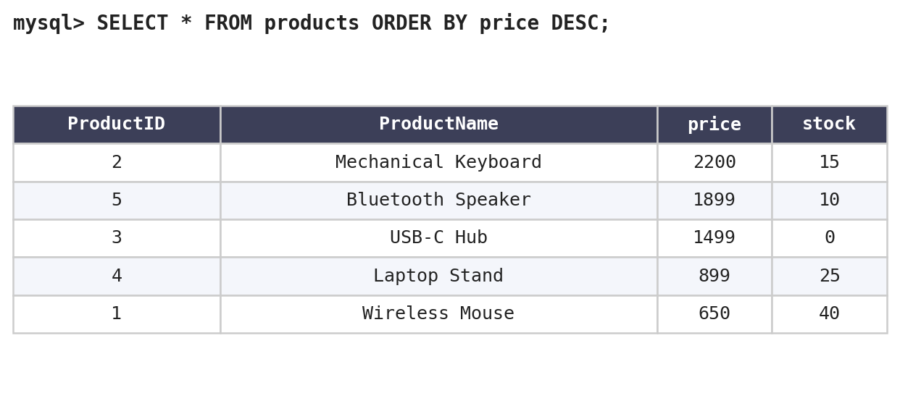
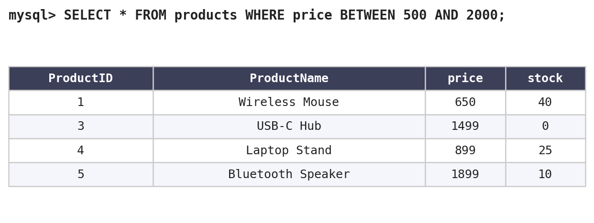
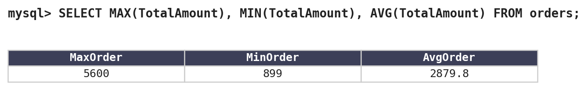
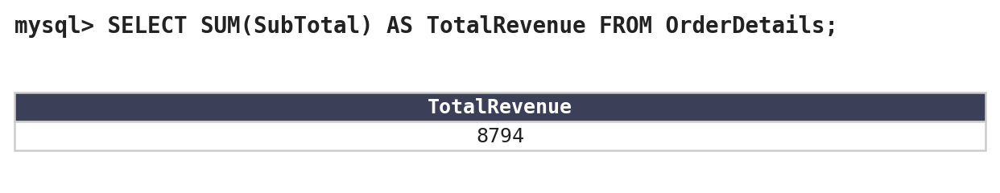
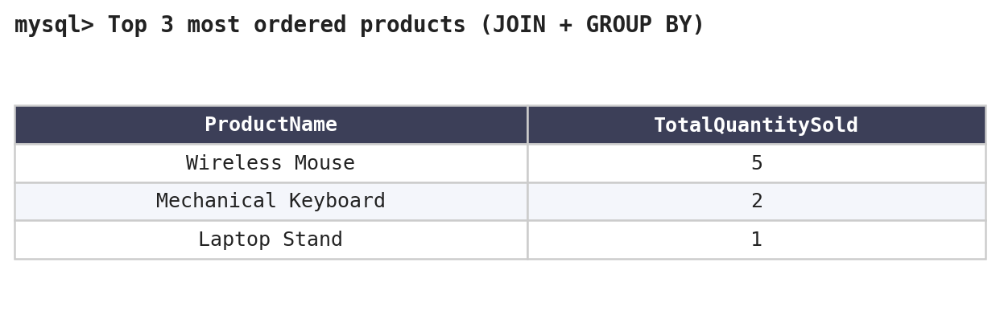

# 🪙 GOLD_DIGGER — E-Commerce SQL Database Project

A relational database project simulating a simple e-commerce system — customers, orders, products, and order details — built to practice core SQL concepts: schema design, CRUD operations, joins, aggregate functions, and foreign key relationships.

*(More query outputs in the [Sample Queries & Output](#-sample-queries--output) section below.)*

---

## 📋 Table of Contents

- [Overview](#-overview)
- [Entity Relationship Diagram](#-entity-relationship-diagram)
- [Database Schema](#-database-schema)
- [Tech Stack](#-tech-stack)
- [Getting Started](#-getting-started)
- [Features & Operations Covered](#-features--operations-covered)
- [Sample Queries & Output](#-sample-queries--output)
- [Assumptions Made](#-assumptions-made)
- [Known Limitations / Notes](#-known-limitations--notes)
- [Possible Enhancements](#-possible-enhancements)
- [Project Structure](#-project-structure)
- [Author](#-author)
- [License](#-license)

---

## 📖 Overview

**GOLD_DIGGER** (a.k.a. "Data Digger") is a hands-on SQL project built for the **Red & White Skill Education** SQL exam brief. It models four related tables of a basic online store:

| Table | Purpose |
|---|---|
| `Customers` | Stores customer contact and address details |
| `Orders` | Stores orders placed by customers, with date and total amount |
| `Products` | Stores the product catalog with price and stock |
| `OrderDetails` | Line-item table linking orders to products (many-to-many bridge) |

The project demonstrates:
- Table creation with primary keys and foreign key constraints
- `INSERT`, `SELECT`, `UPDATE`, `DELETE` (full CRUD) on every table
- Filtering with `WHERE`, `BETWEEN`, and date conditions
- Sorting with `ORDER BY`
- Aggregate functions: `MAX()`, `MIN()`, `AVG()`, `SUM()`, `COUNT()`
- Multi-table `JOIN` with `GROUP BY` for reporting (top-selling products, revenue, etc.)

---

## 🗺 Entity Relationship Diagram

```
┌───────────────┐        ┌───────────────┐        ┌───────────────┐
│   Customers   │        │    Orders     │        │  OrderDetails │
├───────────────┤        ├───────────────┤        ├───────────────┤
│ CustomerID PK │◄──────┐│ OrderID    PK │◄──────┐│ OrderDetailID │
│ Name          │       └│ CustomerID FK │       └│ PK            │
│ Email         │        │ OrderDate     │        │ OrderID    FK │
│ Address       │        │ TotalAmount   │        │ ProductID  FK │
└───────────────┘        └───────────────┘        │ Quantity      │
                                                   │ SubTotal      │
                          ┌───────────────┐        └───────────────┘
                          │   Products    │                ▲
                          ├───────────────┤                │
                          │ ProductID  PK │◄───────────────┘
                          │ ProductName   │
                          │ price         │
                          │ stock         │
                          └───────────────┘
```

> Note: `Orders.CustomerID` is not enforced with a `FOREIGN KEY` constraint in the script — see [Assumptions Made](#-assumptions-made). The diagram shows the intended relationship.

---

## 🧱 Database Schema

<details>
<summary><b>Customers</b></summary>

| Column | Type | Constraint |
|---|---|---|
| CustomerID | INT | PRIMARY KEY, AUTO_INCREMENT |
| Name | VARCHAR(50) | |
| Email | VARCHAR(100) | |
| Address | VARCHAR(150) | |
</details>

<details>
<summary><b>Orders</b></summary>

| Column | Type | Constraint |
|---|---|---|
| OrderID | INT | PRIMARY KEY, AUTO_INCREMENT |
| CustomerID | INT | references `Customers.CustomerID` |
| OrderDate | DATE | |
| TotalAmount | DECIMAL(10,2) | |
</details>

<details>
<summary><b>Products</b></summary>

| Column | Type | Constraint |
|---|---|---|
| ProductID | INT | PRIMARY KEY, AUTO_INCREMENT |
| ProductName | VARCHAR(50) | |
| price | DECIMAL(10,2) | |
| stock | INT | |
</details>

<details>
<summary><b>OrderDetails</b></summary>

| Column | Type | Constraint |
|---|---|---|
| OrderDetailID | INT | PRIMARY KEY, AUTO_INCREMENT |
| OrderID | INT | FOREIGN KEY → `Orders.OrderID` |
| ProductID | INT | FOREIGN KEY → `Products.ProductID` |
| Quantity | INT | |
| SubTotal | DECIMAL(10,2) | |
</details>

---

## 🛠 Tech Stack

- **Database:** MySQL (5.7+ / 8.0)
- **Client:** MySQL Workbench, `mysql` CLI, or any GUI client (DBeaver, HeidiSQL, phpMyAdmin)
- **Language:** Standard SQL (DDL + DML)

---

## 🚀 Getting Started

### Prerequisites
- MySQL Server installed locally, **or** a free-tier cloud MySQL instance (e.g. Aiven, Railway, Clever Cloud, or a local XAMPP/WAMP setup)
- A SQL client (MySQL Workbench is recommended for beginners)

### Steps

1. **Clone the repository**
   ```bash
   git clone https://github.com/rudhiyansh/GOLD_DIGGER.git
   cd GOLD_DIGGER
   ```

2. **Open the SQL file**
   Open `GOLD_DIGGER.sql` in MySQL Workbench (or run it via CLI):
   ```bash
   mysql -u root -p < GOLD_DIGGER.sql
   ```

3. **Run it top to bottom**
   The script creates the database, creates all four tables in the correct order (so foreign keys resolve), inserts sample data, and then runs a series of example queries for each CRUD/reporting operation.

4. **Explore**
   Run individual `SELECT` statements from the file to see each feature in action, or connect a BI tool / dashboard to the resulting database for further practice.

---

## ✅ Features & Operations Covered

| # | Operation | Table(s) |
|---|---|---|
| 1 | Create table with `AUTO_INCREMENT` primary key | All |
| 2 | Bulk `INSERT` of sample records | All |
| 3 | Retrieve all rows (`SELECT *`) | Customers, Orders, Products |
| 4 | Filter by exact match (`WHERE Name = ...`) | Customers |
| 5 | Filter by date range (`CURDATE() - INTERVAL`) | Orders |
| 6 | Filter by numeric range (`BETWEEN`) | Products |
| 7 | `UPDATE` a specific row | Customers, Orders, Products |
| 8 | `DELETE` a specific row / conditional delete | Customers, Orders, Products |
| 9 | Sort results (`ORDER BY ... DESC`) | Products |
| 10 | Aggregate functions — `MAX`, `MIN`, `AVG`, `SUM` | Orders, Products, OrderDetails |
| 11 | Foreign key relationships | OrderDetails → Orders, Products |
| 12 | Multi-table `JOIN` + `GROUP BY` | OrderDetails + Products |
| 13 | `COUNT()` for frequency reporting | OrderDetails + Products |
| 14 | Business reporting: top-selling products, total revenue | OrderDetails |

---

## 📊 Sample Queries & Output

> Screenshots below were generated by actually running the schema and queries against a test database, so the values reflect the sample data included in the script.

**All customers**



**Customers named 'Alice'**



**Products sorted by price (descending)**



**Products priced between ₹500 and ₹2000**



**Order amount statistics — MAX / MIN / AVG**



**Total revenue (from OrderDetails) — SUM**



**Top 3 most-ordered products — JOIN + GROUP BY**



---

## 🧩 Assumptions Made

As instructed in the exam brief, here are the assumptions made while completing this project:

- **Currency:** All prices and order amounts are assumed to be in Indian Rupees (₹), based on the price ranges used (e.g. products priced between ₹500–₹2000).
- **SQL dialect/version:** The script targets **MySQL 8.0** syntax specifically — `AUTO_INCREMENT`, `CURDATE()`, and `INTERVAL` arithmetic are MySQL-specific and would need adjustment for PostgreSQL or SQLite.
- **No `Orders → Customers` foreign key:** The brief's field list for the `Orders` table did not request a `FOREIGN KEY` constraint on `CustomerID`, so it was intentionally left as a plain `INT` column rather than adding a constraint beyond what was specified.
- **Delete order matters:** Deletes (e.g. removing out-of-stock products, removing a customer) are executed in an order that assumes no dependent child rows exist yet in `OrderDetails` at that point in the script — this avoids foreign key violations without needing `ON DELETE CASCADE`, which wasn't part of the brief.
- **Duplicate names allowed:** `Name` in `Customers` is not set as unique, since two customers legitimately named "Alice" are used intentionally to demonstrate the "display all customers named X" query on a non-unique column.
- **"Last 30 days" is relative to the current date** the query is run (`CURDATE()`), not a fixed date — so results will differ depending on when the script is executed relative to the sample order dates.

---

## ⚠️ Known Limitations / Notes

- **`Orders.CustomerID` has no `FOREIGN KEY` constraint** (see assumptions above), so it's technically possible to insert an order for a customer that doesn't exist or was deleted. This mirrors the original schema brief and wasn't a strict requirement.
- If you delete a product or customer **after** related `OrderDetails`/`Orders` rows exist, MySQL will raise a foreign key constraint error — run deletes in the same order the script does, or add `ON DELETE CASCADE` if you extend this project.

---

## 🔮 Possible Enhancements

- Add an `Orders → Customers` foreign key for stricter referential integrity
- Add `ON DELETE CASCADE` / `ON DELETE SET NULL` policies for safer deletes
- Add a `Categories` table and link it to `Products`
- Add indexes on frequently filtered columns (`Email`, `OrderDate`)
- Wrap common reports (top products, revenue by month) into `VIEW`s or stored procedures
- Connect the database to a small Python (pandas / SQLAlchemy) script to turn this into a mini analytics dashboard

---

## 📁 Project Structure

```
GOLD_DIGGER/
│
├── GOLD_DIGGER.sql     # Full schema + sample data + queries
├── README.md           # Project documentation (this file)
└── screenshots/        # Query output screenshots referenced in this README
    ├── 01_all_customers.png
    ├── 02_customers_alice.png
    ├── 03_products_sorted.png
    ├── 04_products_price_range.png
    ├── 05_order_stats.png
    ├── 06_total_revenue.png
    └── 07_top3_products.png
```

---

## 👤 Author

RUDHIYANSH
---

## 📄 License

This project is open-sourced for learning purposes. Feel free to fork, adapt, and use it in your own portfolio.
